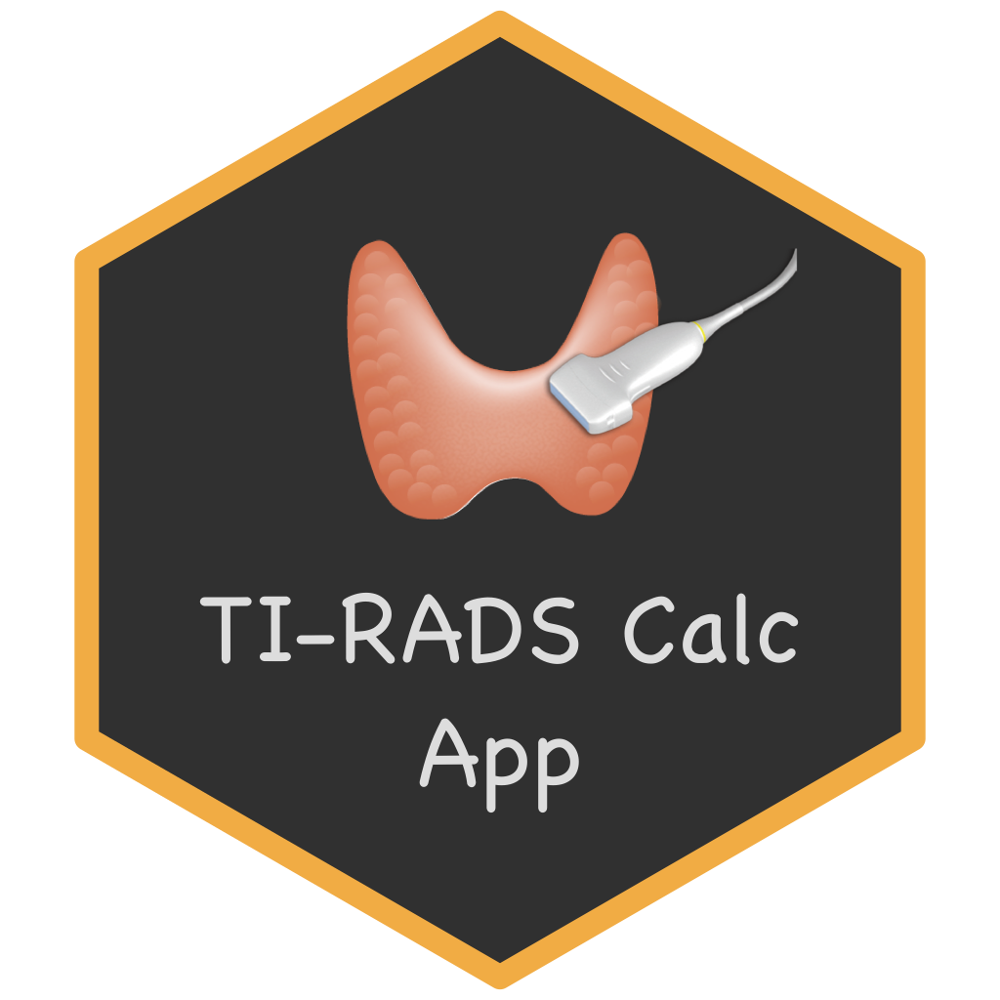

# TIRADS Calculator (Python App) <a href="https://github.com/Lightbridge-KS/tirads-calc-py"></a>


> Calculator webapp implemented from [ACR TI-RADS™](https://www.acr.org/Clinical-Resources/Reporting-and-Data-Systems/TI-RADS) for thyroid ultrasound 

---


**App link:** [**TIRADS Calculator App**](https://kittipos-sir.shinyapps.io/tirads-calculator)

---

- Using [Shiny for Python](https://shiny.posit.co/py/) framework integrated with [Quarto document](https://quarto.org)

## Dev Notes

### Render & Run

**Render Quarto:**

```zsh
quarto render tirads-calc.qmd 
```

**Test Run:**

```zsh
shiny run app.py
```

### Deploy

To shinyapp.io

```zsh
rsconnect deploy shiny . --title tirads-calculator
```
